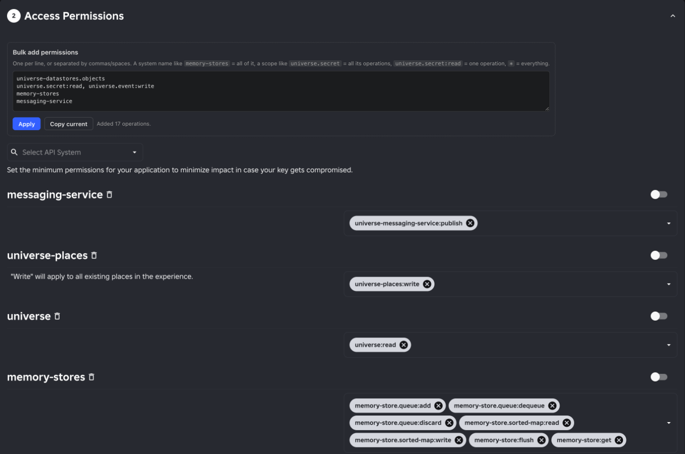

# Roblox API Key Bulk Permissions

Adds a **Bulk add permissions** box to the Access Permissions section of the Create API Key page
on create.roblox.com. Paste a list, click Apply, and every matching operation gets selected.



```
# one per line, or comma/space separated
universe-datastores.objects:read     # one operation (same text the chips show)
universe.secret                      # every operation of a scope
memory-stores                        # a whole API system, as named in the dropdown
*                                    # everything
```

**Copy current** copies whatever is selected on the form as a list you can paste next time.

## Install

Grab the files from the [latest release](https://github.com/brinkokevin/roblox-bulk-perms/releases/latest).

**Chrome, Vivaldi, Edge, Brave, Arc, Opera:** download `roblox-bulk-perms.zip` and unzip it. Open
`chrome://extensions` (in Vivaldi, `vivaldi://extensions`), turn on Developer mode, click **Load unpacked**,
and pick the unzipped folder.

**Firefox, Safari, or anyone who prefers userscripts:** install Tampermonkey or Violentmonkey, then open
[`roblox-bulk-perms.user.js`](https://github.com/brinkokevin/roblox-bulk-perms/releases/latest/download/roblox-bulk-perms.user.js)
and click Install. It updates itself from new releases.

## What it does and doesn't do

- Runs only on `create.roblox.com/dashboard/*`, and needs no extension permissions.
- Fills the form by clicking the page's own dropdowns. You still name the key and click **Save & Generate Key** yourself.
- Makes one network request: an anonymous read (no cookies) of Roblox's public scope list
  (`apis.roblox.com/cloud-authentication/v1/scopes`). It needs this to know which API system a scope
  like `universe.secret` belongs to (`secret-store`).
- Stores nothing, and never reads, saves or sends the generated key.

It's all in [`content.js`](content.js) if you want to check.

Roblox can change the dashboard at any time, which may break this until it's updated.
Not affiliated with or endorsed by Roblox.

## License

MIT
